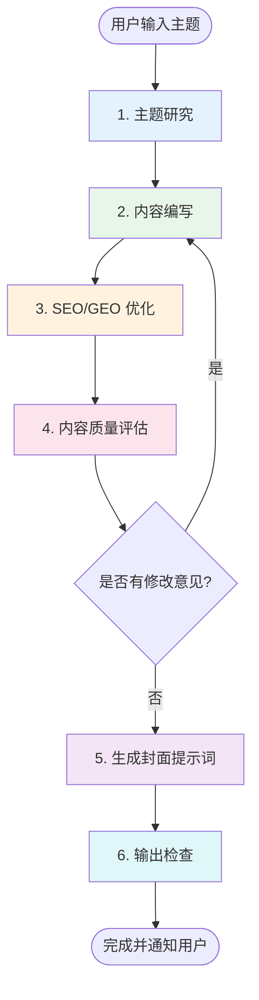
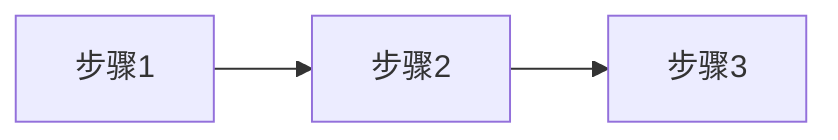
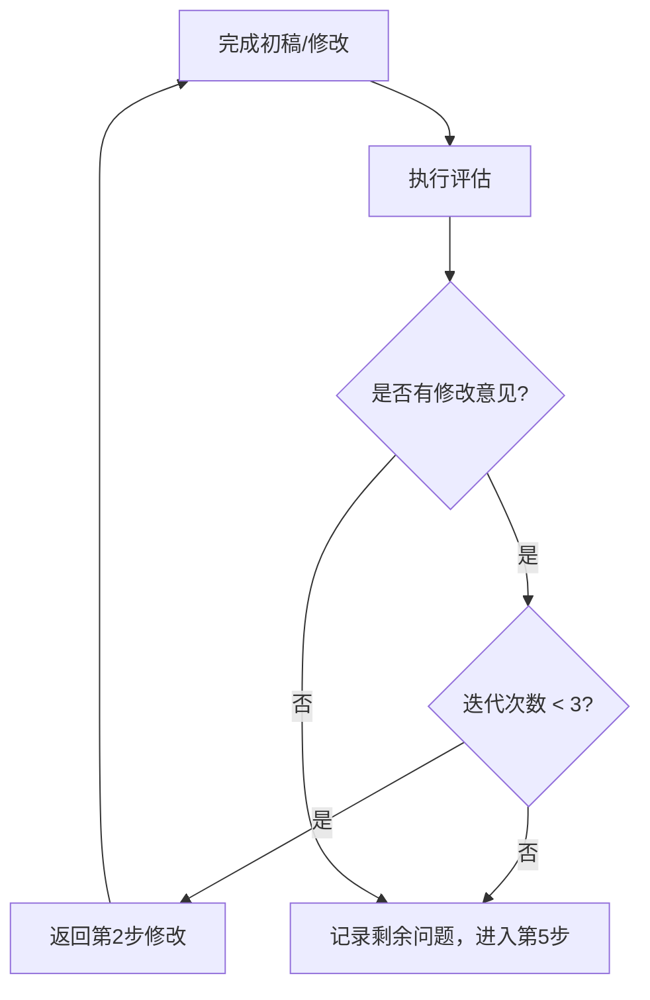

# 博客文档生成工作流

根据用户输入的主题，生成面向初学者的高质量博客文档。

## 工作流程图



---

## 1. 主题研究

**目标**：全面收集主题相关信息，为内容编写提供素材。

**执行步骤**：

使用 `search_web` 工具进行至少 **4 次搜索**，覆盖以下角度：

| 搜索角度 | 搜索关键词示例 | 目的 |
|----------|----------------|------|
| 核心概念 | `{主题} 是什么 原理 概念` | 理解基础定义 |
| 最新进展 | `{主题} 2024 2025 最新 趋势` | 获取时效性信息 |
| 权威来源 | `{主题} 官方文档 论文 arXiv` | 找到可引用的权威资料 |
| 实践应用 | `{主题} 教程 示例 最佳实践` | 收集实际案例 |

**输出**：整理搜索结果，提取以下信息：
- 核心概念定义（2-3 个权威定义）
- 关键知识点列表
- 权威引用来源（论文、官方文档链接）
- 实际应用案例

---

## 2. 内容编写

**目标**：根据研究结果，编写面向初学者的博客文档。

### 2.1 文件命名规则

- **文件名**：使用简洁的中文名称，如 `为什么RAG要使用向量数据库.md`
- **主题简称**：从主题中提取 2-4 个关键词用连字符连接，如 `rag-vector`（用于图片路径）
- **保存位置**：`{当前工程目录}/docs/{文件名}.md`

### 2.2 文档结构模板

```markdown
---
title: {文章标题，包含核心关键词，60字符以内}
category: {分类：人工智能/前端开发/后端开发/DevOps/数据库}
tags: [{标签1}, {标签2}, {标签3}, ...]
description: {SEO描述，100-160字符，包含核心关键词，引导点击}
author: smallyoung
date: {当前日期，格式：YYYY-MM-DD}
dateModified: {当前日期，格式：YYYY-MM-DD}
keywords: [{关键词1}, {关键词2}, ...]
cover: //pub.smallyoung.cn/cdn-cgi/image/quality=60/course_slidev/{主题简称}/cover.png
---

# {文章标题}

> {导语：1-2句话概括本文核心价值，回答"读者能学到什么"}
>
> 📌 **核心论文/文档**：{权威来源链接}  
> 📌 **适合人群**：{目标读者，如：AI初学者、后端开发者}


<MindMapFloat title="{主题}知识图谱">

```mindmap-data
# {主题名称}
## 核心概念
- {要点1}
- {要点2}
## 关键原理
- {原理1}
- {原理2}
## 实际应用
- {场景1}
- {场景2}
```

</MindMapFloat>

## 1. 核心问题导入

{从一个具体问题出发，引出为什么需要了解这个主题}
{使用反问句或场景描述，激发读者兴趣}

## 2. 基础概念解释

{用通俗易懂的语言解释核心概念}
{使用生活类比帮助理解}
{提供概念对比表格}

| 概念 | 定义 | 类比 |
|------|------|------|
| {概念1} | {定义} | {生活类比} |

## 3. 深入原理讲解

{逐层深入，讲解底层原理}
{使用 mermaid 图表可视化流程}



> [!IMPORTANT]
> {核心要点，用提示框突出}

## 4. 实际应用场景

{提供 2-3 个真实应用案例}
{包含可运行的代码示例}

```python
# 示例代码（确保可运行）
```

## 5. 最佳实践与常见问题

{总结 3-5 条最佳实践}

| 误区 | 正确理解 |
|------|----------|
| {常见错误} | {正确做法} |

> [!TIP]
> {关键提示}

## 6. 总结

{用因果链条回顾核心逻辑}

| 概念 | 一句话解释 |
|------|-----------| 
| {概念1} | {简明定义} |

## 7. 参考资料

| 资料 | 作者/机构 | 说明 |
|------|-----------|------|
| [{论文/文档名}]({链接}) | {作者} | {主要贡献} |
```

### 2.3 内容编写原则

**面向初学者**：
- 从**问题出发**，先让读者理解"为什么需要"
- 使用**生活类比**解释抽象概念（如：向量 = 特征列表）
- **循序渐进**：基础概念 → 原理 → 应用 → 最佳实践
- 代码示例必须**可运行**，并附带注释

**内容丰富**：
- 使用**表格**对比方案/概念（至少 3 个表格）
- 使用 **mermaid 图表**可视化流程（至少 2 个图表）
- 使用 **GitHub 风格提示框**突出重点：
  - `> [!NOTE]` - 补充说明
  - `> [!TIP]` - 最佳实践建议
  - `> [!IMPORTANT]` - 核心要点
  - `> [!WARNING]` - 注意事项
  - `> [!CAUTION]` - 常见错误
- 引用**权威来源**（论文、官方文档）

### 2.4 论文引用规范

**arXiv 论文必须使用统一格式**（用于 llms.txt 自动提取）：

```markdown
[论文标题](https://arxiv.org/abs/XXXX.XXXXX)（arXiv:XXXX.XXXXX）
```

**导语核心论文标记**（会被自动提取到 llms.txt）：

```markdown
> 📌 **核心论文**：[Title](https://arxiv.org/abs/XXXX.XXXXX)（arXiv:XXXX.XXXXX）  
> 📌 **适合人群**：...
```

> [!IMPORTANT]
> **只有导语中的 `📌 **核心论文**` 或 `📌 **原始论文**` 标记会被自动提取**。  
> 标记必须位于文档开头 4000 字符内（在 MindMap 组件之后、正文之前）。

**使用场景**：

| 场景 | 格式 | 是否提取 |
|------|------|----------|
| 导语核心论文 | `> 📌 **核心论文**：[Title](url)（arXiv:ID）` | ✅ 会提取 |
| 正文引用 | `[Title](url)（arXiv:ID）` | ❌ 不提取 |
| 参考资料表格 | `[Title](url)` | ❌ 不提取 |

**正确示例**：
```markdown
> 📌 **核心论文**：[Retrieval-Augmented Generation for Knowledge-Intensive NLP Tasks](https://arxiv.org/abs/2005.11401)（arXiv:2005.11401）
```

**错误示例**：
```markdown
❌ 论文名称是 arXiv:2005.11401（缺少论文标题和链接）
❌ [arXiv:2005.11401](https://arxiv.org/abs/2005.11401)（链接文本不应是 ID）
❌ 📌 核心论文：...（缺少粗体标记 **核心论文**）
```

---

## 3. SEO 与 GEO 优化

**目标**：确保文档同时对传统搜索引擎和 AI 搜索引擎友好。

### 3.1 SEO 优化检查（逐项执行）

| 检查项 | 要求 | 自查 |
|--------|------|------|
| H1 标题 | 包含核心关键词，≤60 字符 | ☐ |
| Meta Description | 100-160 字符，含关键词，有吸引力 | ☐ |
| 标题层级 | H2/H3/H4 结构清晰，不跳级 | ☐ |
| 关键词分布 | 核心词出现在标题、首段、小标题 | ☐ |
| 图片 Alt | 所有图片含描述性 alt 文本 | ☐ |
| Frontmatter | title/description/keywords 完整 | ☐ |

### 3.2 GEO 优化检查（逐项执行）

GEO（Generative Engine Optimization）针对 AI 搜索引擎优化：

| 检查项 | 要求 | 自查 |
|--------|------|------|
| 直接回答 | 在导语中直接回答核心问题 | ☐ |
| 权威引用 | 引用学术论文/官方文档（≥2个） | ☐ |
| 结构化内容 | 使用表格、列表、步骤（≥5个） | ☐ |
| 信息密度 | 每段都有实质内容，无水文 | ☐ |
| 专业术语 | 使用行业标准术语 | ☐ |
| 时效性 | 包含最新年份的信息 | ☐ |

---

## 4. 内容质量评估（迭代循环）

**目标**：通过多轮评估确保文档质量达标。

**执行规则**：
1. 完成初稿后执行评估
2. 如有修改意见，返回**第 2 步**修改
3. 修改后重新执行**第 3、4 步**
4. **最多迭代 3 轮**，超过 3 轮后即使有小问题也进入第 5 步
5. 循环终止条件：无修改意见 **或** 已迭代 3 轮



### 4.1 评估维度

| 维度 | 检查要点 | 通过标准 |
|------|----------|----------|
| **正确性** | 技术细节准确，无事实错误 | 无明显技术错误 |
| **完整性** | 覆盖核心知识点 | 覆盖 ≥80% 核心点 |
| **清晰度** | 初学者能理解 | 无歧义表述 |
| **权威性** | 有权威来源支撑 | ≥2 个权威引用 |
| **时效性** | 包含最新信息 | 含当年信息 |
| **格式规范** | 符合模板要求 | 所有必需组件完整 |

### 4.2 评估报告格式

```markdown
## 📋 内容质量评估报告（第 {N} 轮 / 最多 3 轮）

### ✅ 正确性
- {验证通过的技术细节}
- ⚠️ {发现的问题}

### 📚 知识点覆盖
- ✅ 已覆盖：{知识点列表}
- ⚠️ 建议补充：{遗漏的知识点}

### 🔍 表述清晰度
- {表述不清或有歧义的地方}

### 📖 权威来源
- ✅ 已引用：{来源列表}
- ⚠️ 建议补充：{可增加的来源}

### 🆕 时效性
- {最新信息}
- ⚠️ {过时信息}

### 📊 综合评分（1-5分）
| 维度 | 评分 |
|------|------|
| 正确性 | {分数}/5 |
| 完整性 | {分数}/5 |
| 清晰度 | {分数}/5 |
| 权威性 | {分数}/5 |
| 时效性 | {分数}/5 |

### 🔄 修改意见
{如无修改意见，写"无"}

1. {具体修改意见1}
2. {具体修改意见2}

### ⏭️ 下一步
- [ ] **有修改意见且迭代<3轮**：返回第2步修改
- [ ] **无修改意见或已迭代3轮**：进入第5步
```

---

## 5. 封面提示词生成

**目标**：生成 Nano Banana Pro 风格的封面图提示词。

**前置条件**：已通过第 4 步评估（无修改意见或已迭代 3 轮）。

### 5.1 提示词构造规则

| 元素 | 要求 | 示例 |
|------|------|------|
| 主题视觉化 | 将抽象概念转为可视化元素 | 向量 → 连接的数据点 |
| 风格 | 现代科技感、扁平/3D | abstract tech, 3D isometric |
| 色调 | 深色背景+渐变亮色 或 明亮简洁 | dark blue to purple gradient |
| 构图 | 居中、层次分明 | centered composition |
| 排除项 | 无文字、无水印 | no text, no watermark |

### 5.2 提示词模板

```
{主题核心视觉概念的英文描述},
{与主题相关的视觉元素，如：floating data points, neural network, code blocks},
{风格：abstract tech visualization / flat design / 3D isometric / minimalist},
{色调：dark gradient background from {颜色1} to {颜色2} with {强调色} accents},
{构图：centered composition / asymmetric layout / depth of field},
modern digital art style, clean and professional,
no text, no watermark, high quality, 4K, 16:9 aspect ratio
```

### 5.3 生成示例

**输入主题**：为什么 RAG 要使用向量数据库

**输出提示词**：
```
Abstract visualization of vector database and semantic search,
floating data points connected by glowing neural network lines,
geometric shapes representing high-dimensional vectors in space,
3D isometric style with depth,
dark gradient background from deep blue to purple,
cyan and teal accent lights on data nodes,
centered composition with layered depth of field,
modern tech visualization, clean and futuristic,
no text, no watermark, high quality, 4K, 16:9 aspect ratio
```

---

## 6. 输出检查与用户通知

**目标**：确保所有输出完整，并通知用户审阅。

### 6.1 最终检查清单

| 检查项 | 要求 |
|--------|------|
| 文件已保存 | `{当前工程目录}/docs/{主题名称}.md` |
| Frontmatter 完整 | title, category, tags, description, keywords, cover |
| MindMapFloat | 包含知识图谱组件 |
| mermaid 图表 | ≥2 个，语法正确 |
| 表格 | ≥3 个 |
| 代码示例 | 可运行，有注释 |
| 权威引用 | ≥2 个论文/官方文档 |
| 评估报告 | 已生成 |
| 封面提示词 | 已生成 |

### 6.2 用户通知

完成所有步骤后，使用 `notify_user` 工具通知用户：

**通知内容模板**：
```
博客文档已生成完成！

📄 **文件位置**：{当前工程目录}/docs/{文件名}.md
📊 **评估轮次**：{N} 轮
⭐ **综合评分**：{平均分}/5

🎨 **封面提示词**：
{封面提示词}

请审阅文档内容，如需调整请告知。
```

---

## 注意事项

1. **始终面向初学者**：先解释"为什么"，再解释"是什么"和"怎么做"
2. **信息要有据可查**：每个重要技术论点都必须有权威来源
3. **格式保持统一**：严格遵循文档模板结构
4. **图片路径规范**：`//pub.smallyoung.cn/course_slidev/{主题简称}/`
5. **保持客观中立**：技术对比时列出各方案优缺点，不做主观推荐
6. **迭代有限制**：最多 3 轮评估-修改循环，避免无限循环
