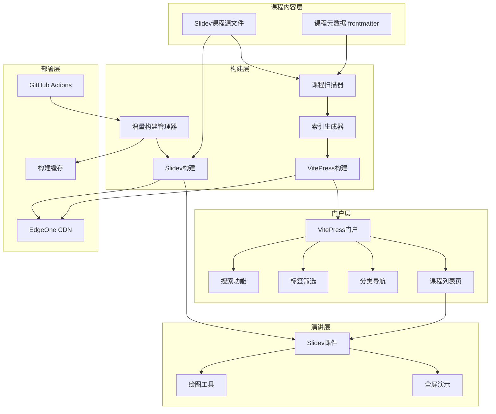

# 设计文档

## 概述

本设计文档描述了现代化课件系统的技术架构和实现方案。系统采用VitePress + Slidev混合架构，通过自动化课程发现、分类标签管理、增量构建优化等技术，为软件学院提供高效的课堂演讲和课程管理解决方案。

### 核心设计目标

1. **自动化管理**：课程自动发现和索引生成，无需手动维护
2. **高性能构建**：增量构建策略，大幅减少构建时间
3. **学生友好**：简洁直观的界面，支持分类、标签和搜索
4. **无缝集成**：VitePress门户与Slidev课件之间流畅切换
5. **云端部署**：支持腾讯云EdgeOne的CDN加速和自动部署

## 架构设计

### 整体架构



### 目录结构设计

```
courseware-system/
├── .github/
│   └── workflows/
│       └── deploy.yml           # CI/CD配置
├── portal/                      # VitePress门户
│   ├── .vitepress/
│   │   ├── config.ts           # VitePress配置
│   │   ├── theme/              # 自定义主题
│   │   │   ├── index.ts
│   │   │   ├── components/     # 门户组件
│   │   │   │   ├── CourseCard.vue
│   │   │   │   ├── CategoryNav.vue
│   │   │   │   ├── TagCloud.vue
│   │   │   │   └── SearchBar.vue
│   │   │   └── styles/
│   │   └── data/
│   │       └── courses.data.ts  # 课程索引数据
│   ├── index.md                 # 门户首页
│   └── public/                  # 静态资源
├── courses/                     # Slidev课程目录
│   ├── frontend/                # 前端教研室
│   │   ├── vue-basics/
│   │   │   └── slides.md       # Slidev课件
│   │   └── react-advanced/
│   │       └── slides.md
│   ├── backend/                 # 后端教研室
│   │   ├── nodejs-intro/
│   │   │   └── slides.md
│   │   └── database-design/
│   │       └── slides.md
│   └── devops/                  # 运维教研室
│       └── docker-basics/
│           └── slides.md
├── scripts/                     # 构建脚本
│   ├── scan-courses.ts         # 课程扫描器
│   ├── generate-index.ts       # 索引生成器
│   └── incremental-build.ts    # 增量构建管理
├── dist/                        # 构建输出
│   ├── portal/                 # VitePress输出
│   └── courses/                # Slidev输出
├── .buildcache/                # 构建缓存
├── package.json
└── tsconfig.json
```

## 组件设计

### 1. 课程扫描器 (Course Scanner)

**职责**：自动扫描courses目录，提取课程元数据

**实现方案**：
- 递归遍历courses目录，查找所有slides.md文件
- 解析Slidev文件的frontmatter，提取元数据：
  - `title`: 课程标题
  - `category`: 分类（教研室）
  - `tags`: 标签数组
  - `description`: 课程描述
  - `author`: 作者
  - `date`: 创建/更新日期
- 生成课程索引JSON文件

**元数据示例**：
```yaml
---
title: Vue.js 基础教程
category: 前端开发
tags: [Vue, JavaScript, 组件化]
description: 从零开始学习Vue.js框架
author: 张老师
date: 2024-01-15
---
```

### 2. 索引生成器 (Index Generator)

**职责**：基于扫描结果生成VitePress数据文件

**实现方案**：
- 读取课程扫描器输出的JSON
- 按分类分组课程
- 统计标签使用频率
- 生成VitePress Data Loader格式的数据文件
- 支持开发环境的热更新

**输出数据结构**：
```typescript
interface Course {
  id: string;              // 课程唯一标识
  title: string;           // 课程标题
  category: string;        // 分类
  tags: string[];          // 标签
  description: string;     // 描述
  author: string;          // 作者
  date: string;            // 日期
  path: string;            // 课程路径
  slideUrl: string;        // Slidev URL
}

interface CourseIndex {
  courses: Course[];                    // 所有课程
  categories: Map<string, Course[]>;    // 按分类分组
  tags: Map<string, Course[]>;          // 按标签分组
  tagStats: Map<string, number>;        // 标签统计
}
```

### 3. VitePress门户组件

#### CourseCard.vue - 课程卡片
- 显示课程标题、描述、分类、标签
- 提供"查看课程"和"进入演讲模式"按钮
- 响应式设计，支持网格布局

#### CategoryNav.vue - 分类导航
- 显示所有分类及课程数量
- 支持点击切换分类
- 高亮当前选中分类

#### TagCloud.vue - 标签云
- 根据标签使用频率调整字体大小
- 支持点击标签筛选课程
- 显示标签对应的课程数量

#### SearchBar.vue - 搜索栏
- 支持课程标题、描述、标签的全文搜索
- 实时搜索结果展示
- 搜索历史记录

### 4. 增量构建管理器

**职责**：检测文件变更，实现增量构建

**实现方案**：

1. **变更检测**：
   - 使用Git diff检测变更的文件
   - 计算文件内容的哈希值
   - 维护构建缓存映射表

2. **缓存策略**：
   ```typescript
   interface BuildCache {
     version: string;
     timestamp: number;
     courses: {
       [coursePath: string]: {
         hash: string;        // 文件内容哈希
         buildTime: number;   // 构建时间
         outputPath: string;  // 输出路径
       }
     }
   }
   ```

3. **构建决策**：
   - 课程文件变更 → 重新构建该课程
   - 课程文件未变更 → 复用缓存
   - 门户配置变更 → 重新生成索引，保留课程缓存
   - 全局依赖变更 → 全量构建

4. **缓存复用**：
   - 从缓存目录复制已构建的课程文件
   - 更新索引中的课程链接
   - 验证缓存完整性

## 数据模型

### 课程元数据模型

```typescript
interface CourseMeta {
  // 基础信息
  title: string;              // 课程标题（必填）
  category: string;           // 分类（必填）
  tags: string[];             // 标签（必填，至少1个）
  description: string;        // 课程描述（必填）
  
  // 作者信息
  author: string;             // 作者姓名
  email?: string;             // 作者邮箱
  
  // 时间信息
  date: string;               // 创建日期
  updated?: string;           // 更新日期
  
  // 课程属性
  level?: 'beginner' | 'intermediate' | 'advanced';  // 难度级别
  duration?: number;          // 预计时长（分钟）
  
  // Slidev配置
  theme?: string;             // Slidev主题
  highlighter?: string;       // 代码高亮器
  drawings?: boolean;         // 是否启用绘图
}
```

### 索引数据模型

```typescript
interface CourseIndex {
  // 元信息
  version: string;            // 索引版本
  generated: string;          // 生成时间
  
  // 课程数据
  courses: Course[];          // 所有课程列表
  
  // 分类数据
  categories: {
    name: string;             // 分类名称
    count: number;            // 课程数量
    courses: string[];        // 课程ID列表
  }[];
  
  // 标签数据
  tags: {
    name: string;             // 标签名称
    count: number;            // 使用次数
    courses: string[];        // 课程ID列表
  }[];
  
  // 统计信息
  stats: {
    totalCourses: number;     // 总课程数
    totalCategories: number;  // 总分类数
    totalTags: number;        // 总标签数
  };
}
```

## 接口设计

### VitePress Data Loader

```typescript
// portal/.vitepress/data/courses.data.ts
import { createContentLoader } from 'vitepress';
import { scanCourses } from '../../../scripts/scan-courses';
import { generateIndex } from '../../../scripts/generate-index';

export default {
  async load() {
    // 扫描课程
    const courses = await scanCourses('./courses');
    
    // 生成索引
    const index = generateIndex(courses);
    
    return index;
  }
}
```

### 课程扫描API

```typescript
// scripts/scan-courses.ts
export interface ScanOptions {
  baseDir: string;           // 课程根目录
  pattern?: string;          // 文件匹配模式
  exclude?: string[];        // 排除目录
}

export async function scanCourses(
  options: ScanOptions
): Promise<Course[]> {
  // 实现课程扫描逻辑
}
```

### 增量构建API

```typescript
// scripts/incremental-build.ts
export interface BuildOptions {
  cacheDir: string;          // 缓存目录
  force?: boolean;           // 强制全量构建
  verbose?: boolean;         // 详细日志
}

export async function incrementalBuild(
  options: BuildOptions
): Promise<BuildResult> {
  // 实现增量构建逻辑
}

export interface BuildResult {
  total: number;             // 总课程数
  built: number;             // 实际构建数
  cached: number;            // 缓存复用数
  duration: number;          // 构建耗时
  courses: {
    path: string;
    status: 'built' | 'cached' | 'failed';
    duration?: number;
    error?: string;
  }[];
}
```

## 错误处理

### 课程扫描错误

1. **文件读取失败**：
   - 记录错误日志
   - 跳过该课程，继续扫描
   - 在索引中标记为"不可用"

2. **元数据格式错误**：
   - 验证必填字段
   - 提供默认值
   - 警告提示

3. **重复课程ID**：
   - 基于路径生成唯一ID
   - 记录冲突警告

### 构建错误

1. **Slidev构建失败**：
   - 记录详细错误信息
   - 保留上次成功构建的缓存
   - 在门户中显示"构建失败"状态

2. **缓存损坏**：
   - 检测缓存完整性
   - 自动清理损坏缓存
   - 重新构建受影响课程

3. **部署失败**：
   - 重试机制（最多3次）
   - 回滚到上一个成功版本
   - 发送通知

## 测试策略

### 单元测试

- 课程扫描器：测试各种元数据格式
- 索引生成器：测试数据转换逻辑
- 增量构建：测试缓存命中和失效场景

### 集成测试

- 完整构建流程：从扫描到部署
- 热更新功能：开发环境文件变更
- CI/CD流程：GitHub Actions触发构建

### 端到端测试

- 门户导航：分类、标签、搜索功能
- 课程访问：从门户跳转到Slidev
- 响应式布局：不同屏幕尺寸

## 性能优化

### 构建性能

1. **并行构建**：
   - 使用Worker线程并行构建多个课程
   - 限制并发数避免资源耗尽

2. **增量构建**：
   - 文件哈希缓存
   - 依赖关系追踪
   - 智能缓存失效

3. **构建优化**：
   - Vite的代码分割
   - 图片压缩和优化
   - 移除未使用的依赖

### 运行时性能

1. **门户优化**：
   - 虚拟滚动（课程列表）
   - 懒加载图片
   - 搜索防抖

2. **CDN加速**：
   - EdgeOne全球节点
   - 静态资源缓存
   - Gzip/Brotli压缩

3. **预加载策略**：
   - 首页关键资源预加载
   - 课程列表分页加载
   - 预测性预加载（鼠标悬停）

## 部署方案

### GitHub Actions工作流

```yaml
name: 构建和部署

on:
  push:
    branches: [main]
  pull_request:
    branches: [main]

jobs:
  build:
    runs-on: ubuntu-latest
    steps:
      - uses: actions/checkout@v3
        with:
          fetch-depth: 0  # 获取完整历史用于增量构建
      
      - name: 设置Node.js
        uses: actions/setup-node@v3
        with:
          node-version: '18'
          cache: 'npm'
      
      - name: 安装依赖
        run: npm ci
      
      - name: 恢复构建缓存
        uses: actions/cache@v3
        with:
          path: .buildcache
          key: build-cache-${{ github.sha }}
          restore-keys: build-cache-
      
      - name: 增量构建
        run: npm run build:incremental
      
      - name: 部署到EdgeOne
        env:
          EDGEONE_SECRET_ID: ${{ secrets.EDGEONE_SECRET_ID }}
          EDGEONE_SECRET_KEY: ${{ secrets.EDGEONE_SECRET_KEY }}
        run: npm run deploy:edgeone
```

### EdgeOne部署配置

1. **静态资源上传**：
   - 使用腾讯云COS SDK上传dist目录
   - 设置正确的Content-Type
   - 启用Gzip压缩

2. **CDN配置**：
   - 配置缓存规则（HTML: 5分钟，静态资源: 1年）
   - 启用HTTPS
   - 配置自定义域名

3. **增量部署**：
   - 仅上传变更的文件
   - 使用文件哈希作为版本标识
   - 自动刷新CDN缓存

## 安全考虑

1. **输入验证**：
   - 验证课程元数据格式
   - 防止路径遍历攻击
   - XSS防护

2. **访问控制**：
   - EdgeOne访问密钥安全存储
   - GitHub Secrets管理敏感信息
   - 限制构建触发权限

3. **内容安全**：
   - CSP (Content Security Policy)
   - HTTPS强制
   - 防止恶意脚本注入

## 可扩展性

### 未来扩展方向

1. **多语言支持**：
   - i18n国际化框架
   - 课程多语言版本

2. **用户系统**：
   - 学习进度追踪
   - 课程收藏和笔记
   - 个性化推荐

3. **互动功能**：
   - 课程评论和评分
   - 在线练习和测验
   - 实时问答

4. **数据分析**：
   - 课程访问统计
   - 学习行为分析
   - 热门课程推荐

### 插件系统

设计插件接口，支持第三方扩展：
- 自定义Slidev主题
- 自定义门户组件
- 自定义构建流程
- 自定义部署目标
