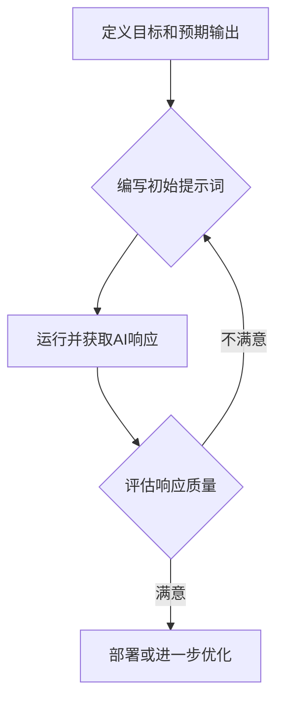

<style>
    .slidev-page {
      overflow-y: auto !important;
      scroll-behavior: smooth;
      scrollbar-width: none;
      -ms-overflow-style: none;
      user-select: text !important;
      -webkit-user-select: text !important;
    }
    
    .slidev-page::-webkit-scrollbar {
      display: none;
    }
    
    /* 添加这些规则 */
    .slidev-page * {
      user-select: text !important;
      -webkit-user-select: text !important;
    }
    
    .slidev-layout,
    .slidev-code,
    h1, h2, h3, h4, h5, h6, p, li, span, div {
      user-select: text !important;
      -webkit-user-select: text !important;
    }
</style>

# 提示词工程

提示词工程课程

<div class="pt-12">
  <span @click="$slidev.nav.next" class="px-2 py-1 rounded cursor-pointer" hover="bg-white bg-opacity-10">
    开始学习 <carbon:arrow-right class="inline"/>
  </span>
</div>

<div class="abs-br m-6 flex gap-2">
  <a href="https://github.com/slidevjs/slidev" target="_blank" alt="GitHub" title="Open in GitHub"
    class="text-xl slidev-icon-btn opacity-50 !border-none !hover:text-white">
    <carbon-logo-github />
  </a>
</div>

---


# 📚 第一章: 提示词工程基础入门

嘿，朋友们！欢迎来到提示词工程的奇妙世界。

---

# 💡 什么是提示词工程？

想象一下，你有一个超级聪明的机器人助手，它能帮你写文章、编代码、甚至讲故事。

<v-clicks>

但是，机器人再聪明，也需要你清晰准确地告诉它“做什么”。

这就是**提示词工程**（Prompt Engineering）的核心：
<div v-click>

### **🌟 一门“教AI好好说话”的艺术和科学。**

</div>
<div v-click>

它研究的是怎么设计和优化我们给AI（特别是大语言模型LLM）的“指令”（也就是**提示词**），让AI能更好地理解我们的意图，并给出我们想要的、高质量的回答。

</div>

</v-clicks>

---

# 🚀 为什么提示词工程很重要？

掌握提示词工程，就像掌握了和未来AI沟通的“密码”。

<v-clicks>

- **提升效率**: 告别反复修改，一次到位！
  <div v-click>

  用精准的提示词，让AI快速产出你想要的内容。

  </div>

- **解锁AI潜力**: 让AI不只是“聊天”，更能“办事”！
  <div v-click>

  通过巧妙的提示，让AI完成更复杂、更专业的任务。

  </div>

- **获得更好结果**: AI输出的质量，很大程度上取决于你的提问水平。
  <div v-click>

  高质量的提示词能带来更准确、更有用的回答。

  </div>

</v-clicks>

---

# 🤖 大语言模型（LLM）是什么？

提示词工程的主角，就是**大语言模型**（Large Language Models，简称LLM）。

<v-clicks>

- **超级大脑**: 把LLM想象成一个拥有海量知识的超级大脑。
  <div v-click>

  它学习了互联网上无数的文字信息，所以懂得多、会得多。

  </div>

- **语言专家**: 它最擅长理解和生成人类的语言。
  <div v-click>

  无论是写诗、编故事、翻译，还是回答问题，它都能游刃有余。

  </div>

- **沟通桥梁**: 我们可以通过文字（也就是提示词）和这个“超级大脑”沟通。
  <div v-click>

  它就像一个非常善于理解和表达的伙伴。

  </div>

</v-clicks>

---

# 🤝 LLM与提示词的关系

大语言模型（LLM）就像一个强大的“发动机”，而提示词就是掌控方向的“方向盘”。

<v-clicks>

- **输入与输出**: 提示词是我们给LLM的“输入”。
  <div v-click>

  LLM接收这些输入，然后根据它的理解和学习到的知识，生成“输出”（也就是回答）。

  </div>

- **引导与约束**: 提示词不仅仅是问题，更是一种“引导”和“约束”。
  <div v-click>

  它告诉LLM要扮演什么角色、完成什么任务、应该注意哪些细节，以及最终以什么形式呈现。

  </div>

- **你的指令，AI的行动**: 你的提示词越清晰、越具体，LLM就越能心领神会。
  <div v-click>

  反之，模糊的指令会让LLM无从下手，或者给出你意想不到的答案。

  </div>

</v-clicks>

---

# 🏗️ 提示词的基本结构

一个好的提示词，就像一份清晰的任务说明书，它通常包含几个关键要素。

<v-clicks>

<div v-click>

把这些要素组合起来，就能让LLM更好地理解你的意图。

</div>

- **🎭 角色 (Role)**: 你希望AI扮演什么角色？
- **📝 任务 (Task)**: 你希望AI完成什么具体工作？
- **🌍 上下文 (Context)**: 告诉AI相关的背景信息。
- **📏 格式 (Format)**: 你希望AI以什么形式输出结果？
- **💡 示例 (Examples)**: 提供一些例子来指导AI（可选，但非常有效）。

</v-clicks>

---

# 🎭 提示词结构：角色 (Role)

给AI设定一个“角色”，它会更贴合这个角色的视角和语气来回答。

<v-clicks>

- **什么是角色？**
  <div v-click>

  就是告诉AI，现在请你“变身”成某个专业人士或某种身份。

  </div>

- **为什么有用？**
  <div v-click>

  LLM会调动其知识库中与该角色相关的语言风格、专业知识和思考方式。

  </div>

- **💡 示例**:


```
你现在是一名专业的市场营销专家。
你是一名小学语文老师。
请你扮演一位严谨的科研人员。
```

</v-clicks>

---

# 📝 提示词结构：任务 (Task)

“任务”是提示词的核心，它明确告诉AI“你要做什么”。

<v-clicks>

- **什么是任务？**
  <div v-click>

  你希望AI帮你完成的具体操作或回答的具体问题。

  </div>

- **为什么有用？**
  <div v-click>

  直接驱动AI的行为，让它知道应该朝着哪个方向努力。

  </div>

- **💡 示例**:


```
请帮我生成一个关于新产品的宣传文案。
请总结以下文章的核心观点。
请为我创作一首关于春天的五言绝句。
```

</v-clicks>

---

# 🌍 提示词结构：上下文 (Context)

“上下文”是给AI提供“背景信息”，让它更好地理解你的问题。

<v-clicks>

- **什么是上下文？**
  <div v-click>

  与任务相关的背景知识、前提条件、数据或额外的说明。

  </div>

- **为什么有用？**
  <div v-click>

  避免AI“脑补”或给出泛泛的回答，让它聚焦于你实际关心的内容。

  </div>

- **💡 示例**:


```
新产品是智能音箱，目标用户是年轻人，卖点是语音交互和时尚设计。
以下是需要总结的文章内容：[文章内容]
我希望诗歌能体现出“生机勃勃”和“希望”的主题。
```

</v-clicks>

---

# 📏 提示词结构：格式 (Format)

“格式”是告诉AI，“请你按照我要求的方式来呈现结果”。

<v-clicks>

- **什么是格式？**
  <div v-click>

  指明输出的结构，比如字数限制、列表形式、段落数量、代码语言等。

  </div>

- **为什么有用？**
  <div v-click>

  保证输出结果符合你的预期，方便后续使用。

  </div>

- **💡 示例**:


```
请以三段话的形式输出，每段包含一个卖点。
请用Markdown列表的形式呈现。
请生成Python代码。
总结字数控制在100字以内。
```

</v-clicks>

---

# ✨ 组合一个完整提示词

把我们学过的这些要素组合起来，一个完整的提示词就诞生了！

<v-clicks>

- **任务场景**：你需要AI帮你写一个智能音箱的宣传文案。

<div v-click>


```
你是一名专业的市场营销专家。
请帮我生成一个关于新产品的宣传文案。
新产品是智能音箱，目标用户是年轻人，卖点是语音交互和时尚设计。
请以三段话的形式输出，每段包含一个卖点，并加上吸引人的标题。
```

</div>
<div v-click>

你看，通过清晰的角色、任务、上下文和格式，AI就能更好地理解你的需求，生成更满意的结果。

</div>

</v-clicks>

---

# 🛠️ 提示词工具与环境

就像学习编程需要代码编辑器一样，学习提示词工程也需要一些“练手”的工具。

<v-clicks>

<div v-click>

这些工具能帮助我们轻松地和大语言模型互动，测试各种提示词的效果。

</div>

它们的主要作用是：

- **即时反馈**: 编写提示词后，立即看到LLM的响应。
- **方便实验**: 快速尝试不同的提示词写法，比较效果。
- **参数调节**: 有些工具还能调整LLM的参数，影响其生成风格。

</v-clicks>

---

# 🕹️ 在线 Playground 是什么？

最常见的提示词工具，就是各种**在线 Playground**（沙盒环境）。

<v-clicks>

- **交互式界面**: 它们通常是一个网页界面。
  <div v-click>

  你可以在其中输入提示词，然后点击“生成”按钮，LLM就会在下方给出回答。

  </div>

- **轻松上手**: 无需复杂的配置和编程知识，小白也能轻松玩转。
  <div v-click>

  就像在一个“游乐场”里，你可以自由地探索和实验。

  </div>

- **学习利器**: 是我们学习和掌握提示词工程的最佳实践平台。

</v-clicks>

---

# 🌐 探索常见 Playground

市面上有很多方便易用的在线Playground，让你能立刻开始实践提示词工程！

<v-clicks>

1.  **ChatGPT/Bard (Gemini) 等官方对话界面**:
    <div v-click>

    最直接、最常用的工具，直接在对话框里输入你的提示词即可。

    </div>

2.  **OpenAI Playground**:
    <div v-click>

    OpenAI官方提供的更高级的实验平台，可以调整更多模型参数。

    </div>

3.  **Hugging Face Spaces**:
    <div v-click>

    这里有很多基于不同LLM构建的应用，你可以尝试各种有趣的提示词玩法。

    </div>

</v-clicks>

# 💡 第二章: 高效提示词设计核心技巧

大家好！欢迎来到第二章，我们将一起探索如何设计出又“聪明”又“听话”的提示词。

<v-clicks>

- **清晰与具体的指令原则**：让AI理解你的真正意图。
- **角色扮演与System Prompt**：给AI一个身份，让它更好地工作。
- **Few-shot prompting**：用“示范”来教AI。
- **结构化输出与分隔符**：让AI的回答整整齐齐。
- **基础提示词实践**：动手操作，让理论照进现实！

</v-clicks>

---

# 🎯 清晰与具体的指令原则 (1/3)

## 什么是“清晰与具体”？

想象一下，你让朋友帮忙买菜：

<div v-click>

## ❌ 模糊指令：

“帮我买点菜回来。”

</div>

<div v-click>

## ✅ 清晰指令：

“请帮我买**三斤新鲜的西红柿、一棵大白菜和两根玉米**，记得要**看起来新鲜、没有破损**的哦！”

</div>

<div v-click>

AI也是一样，你给它的指令越清楚、越具体，它就越能准确地理解你的需求，给出你想要的答案。

</div>

---

# 🎯 清晰与具体的指令原则 (2/3)

## 为什么它这么重要？

<v-clicks>

- **避免误解**: 模糊的指令会让AI“猜”，结果可能驴唇不对马嘴。
- **提高效率**: AI能更快地给出正确答案，省去你反复修改提示词的麻烦。
- **得到高质量输出**: 清晰的指令就像指路明灯，引导AI生成更专业、更有用的内容。
- **节省成本**: 对于付费的API，减少无效尝试就是节省真金白银！

</v-clicks>

---

# 🎯 清晰与具体的指令原则 (3/3)

## 如何让指令变得“清晰又具体”？

<v-clicks>

- **说明目标**: 你希望AI完成什么任务？（例如：生成摘要、回答问题、写文章）
- **提供背景**: 必要的上下文信息，让AI了解情况。（例如：这篇文章是关于什么的）
- **限定范围**: 告诉AI它应该关注哪些信息，忽略哪些。（例如：只总结核心观点，不涉及细节）
- **指定格式**: 如果你希望有特定的输出格式，一定要明确说明。（例如：以列表形式、JSON格式）
- **给出约束**: 对内容的长度、风格、语气等提出要求。（例如：回答不超过100字，语气专业）

</v-clicks>

---

# 📚 实践案例: 清晰与具体的指令

## 任务：总结一段文字

<div v-click>

## ❌ 模糊指令示例：


```text
请总结以下文章：
```


</div>

<div v-click>

> **AI可能会怎么做？**
>
> 可能会总结得太长、太短，或者抓不住重点。

</div>

---

# 📚 实践案例: 清晰与具体的指令

<div v-click>

## ✅ 清晰指令示例：


```text
你是一位资深编辑。
请阅读下面的文章，用100字以内的篇幅，总结其核心观点。
总结内容必须是中文，并以条理清晰的3个要点呈现。
文章内容：
'''
[这里是文章内容]
'''
```


</div>

<v-clicks>

- **说明目标**: 总结文章核心观点。
- **提供背景/角色**: “资深编辑”。
- **限定范围**: “100字以内”、“3个要点”。
- **指定格式**: “中文”、“条理清晰”。

</v-clicks>

---

# 🎭 角色扮演与System Prompt (1/3)

## 什么是“角色扮演”？

就像导演给演员分配角色一样，你可以给AI设定一个身份，让它以这个身份来思考和回答问题。

<v-clicks>

- 当AI拥有特定“角色”后，它会更自然地采用符合该角色的知识、语气和风格来执行任务。
- 比如，让AI扮演“历史学家”，它就会用严谨、客观的语言来分析历史事件。

</v-clicks>

---

# 🎭 角色扮演与System Prompt (2/3)

## System Prompt（系统提示）

<v-clicks>

- **它是什么？** `System Prompt` 就像给AI下达的“总指挥令”，它告诉AI你的基本设定和长期目标。
- **有什么用？** 它可以让AI长期保持某个角色或行为模式，而不会被后续的普通对话（User Prompt）轻易“带偏”。
- **怎么用？** 通常在对话的开始，作为给AI的第一个、最重要的指令。

</v-clicks>

---

# 🎭 角色扮演与System Prompt (3/3)

## System Prompt 实践案例

<div v-click>


```text
你是一个专业的食谱作家。你的任务是为健康饮食爱好者提供创新且易于制作的素食食谱。
确保你的所有回复都包含食材清单、详细步骤和营养小贴士。
你的语气应该友好、鼓励，并专注于健康益处。
```


</div>

<v-clicks>

- **角色**: “专业的食谱作家”。
- **任务**: 提供“创新且易于制作的素食食谱”。
- **输出要求**: “食材清单、详细步骤和营养小贴士”。
- **语气**: “友好、鼓励，并专注于健康益处”。

</v-clicks>

---

# 📚 实践案例: 角色扮演

## 场景：获取烹饪建议

<div v-click>

## ❌ 无角色扮演指令：


```text
给我一个番茄炒蛋的食谱。
```


</div>

<div v-click>

> **AI可能会怎么做？**
>
> 可能会提供一个通用、缺乏特色或细节的食谱。

</div>

---

# 📚 实践案例: 角色扮演

<div v-click>

## ✅ 有角色扮演指令：


```text
你是米其林三星大厨。
请你用最简单易懂的方式，教我如何制作一道色香味俱全的“意式番茄炒蛋”。
除了步骤，还要告诉我选材的小窍门和提升口感的秘诀。
```


</div>

<v-clicks>

- **角色**: “米其林三星大厨”。
- **任务**: 制作“意式番茄炒蛋”，并包含“选材小窍门”和“提升口感秘诀”。
- **语气/风格**: “最简单易懂的方式”，体现专业性。

</v-clicks>

---

# 💡 Few-shot Prompting (少样本学习) (1/3)

## 什么是“少样本学习”？

<v-clicks>

- 想象一下，你不是直接告诉AI怎么做，而是**给它看几个“榜样”**！
- 就像你教小朋友画画，不是讲一堆理论，而是直接画几幅给他看，说：“像这样画！”
- AI会从这些例子中学习模式，然后应用到你的新问题上。

</v-clicks>

---

# 💡 Few-shot Prompting (少样本学习) (2/3)

## 为什么它这么有效？

<v-clicks>

- **提高准确性**: 特别是对于复杂的、有特定格式或风格要求任务。
- **减少歧义**: 例子能消除语言描述可能带来的模糊性。
- **节省时间**: 有时候，一个好例子胜过千言万语。
- **应对特定格式**: 如果你需要AI输出特定格式（如JSON、XML），Few-shot Prompting 是一个非常强大的工具。

</v-clicks>

---

# 💡 Few-shot Prompting (少样本学习) (3/3)

## 少样本学习的应用场景

<v-clicks>

- **情感分析**: 给出几段文字及对应的情感（积极/消极），让AI判断新文本。
- **实体抽取**: 给出几句话，并标注其中的人名、地名，让AI在新文本中抽取。
- **格式转换**: 给出几个输入-输出对，让AI学习转换规则。
- **特定风格生成**: 给出几段特定风格的文字，让AI模仿。

</v-clicks>

---

# 📚 实践案例: Few-shot Prompting

## 任务：判断用户评论情感

<div v-click>

## ❌ Zero-shot (零样本) 指令：


```text
请判断以下评论的情感是积极还是消极：
“这手机电池太不耐用了！”
```


</div>

<div v-click>

> **AI可能会怎么做？**
>
> 即使AI知道“不耐用”是负面词汇，但有时会受上下文影响。

</div>

---

# 📚 实践案例: Few-shot Prompting

<div v-click>

## ✅ Few-shot (少样本) 指令：


```text
评论：这个电影太棒了，我看了两遍！
情感：积极

评论：等了半小时才上菜，服务态度也不好。
情感：消极

评论：虽然有点小贵，但这个产品的质量真的没话说。
情感：积极

评论：这手机电池太不耐用了！
情感：
```


</div>

<v-clicks>

- **示例展示**: 提供了3个输入-输出对，明确了“评论”和“情感”的对应关系。
- **模式学习**: AI会学习到“好评”对应“积极”，“差评”对应“消极”的模式，并能处理一些带有转折的评论。

</v-clicks>

---

# 🧱 结构化输出与分隔符运用 (1/3)

## 为什么需要结构化输出？

<v-clicks>

- AI生成的文本有时会是一大段文字，阅读起来很累。
- 如果我们想从AI的回答中提取特定信息，没有结构就会很困难。
- 想象一下，你在餐厅点菜，菜单上菜名、价格、配料都混在一起，是不是很头疼？

</v-clicks>

---

# 🧱 结构化输出与分隔符运用 (2/3)

## 什么是分隔符？

<v-clicks>

- 分隔符就像给AI的回答画“分界线”，让不同的信息块清晰可见。
- 常见的有：`###`、`---`、`***`、`<`tag`>`、`:`、换行符等。
- 作用：帮助AI理解不同部分的内容，并以你想要的结构输出。

</v-clicks>

---

# 🧱 结构化输出与分隔符运用 (3/3)

## 结构化输出的类型与分隔符

<v-clicks>

- **列表 (List)**: 使用`-` 或 `1.`
- **表格 (Table)**: 使用Markdown表格语法 `| 列1 | 列2 |`
- **JSON / XML**: 使用代码块包裹，指定格式。
- **分段标题**: 使用`###` 来分隔不同主题。
- **自定义标记**: 使用例如`<<Summary>>`、`<Recipe>`等自定义标签。

</v-clicks>

---

# 📚 实践案例: 结构化输出

## 任务：提取文章关键信息

<div v-click>

## ❌ 无分隔符指令：


```text
请总结这篇文章的作者、主题和主要论点。
```


</div>

<div v-click>

> **AI可能会怎么做？**
>
> 可能以一段连续的文字输出，让你难以一眼找到所需信息。

</div>

---

# 📚 实践案例: 结构化输出

<div v-click>

## ✅ 有分隔符指令：


```text
请阅读下面的文章，并以以下结构提取信息：

### 作者
[提取的作者名]

### 主题
[提取的文章主题]

### 主要论点
- 论点1
- 论点2
- 论点3

文章内容：
'''
[这里是文章内容]
'''
```


</div>

<v-clicks>

- **分段标题**: 使用 `###` 清晰地分隔了作者、主题和论点。
- **列表格式**: 主要论点以 `-` 列表形式呈现，方便阅读。
- **模板指导**: AI会严格按照你提供的模板来填充信息。

</v-clicks>

---

# 📝 基础提示词实践：摘要与问答 (1/4)

## 摘要任务

<v-clicks>

- **目标**: 从一篇长文章中提取最核心的信息，形成一篇简短的总结。
- **难点**: 容易遗漏关键信息，或者总结过于冗长。
- **提示词技巧**:
    - 明确摘要的**长度限制**（例如：100字以内，3句话）。
    - 指定摘要的**受众**（例如：为小学生总结，为专业人士总结）。
    - 强调摘要的**重点**（例如：只总结解决方案，不总结问题背景）。

</v-clicks>

---

# 📝 基础提示词实践：摘要与问答 (2/4)

## 实践案例: 文章摘要

<div v-click>


```text
你是一位经验丰富的新闻编辑。
请阅读以下关于“全球气候变暖”的报道，并用不超过80字，为普通读者撰写一份新闻摘要。
摘要必须包含：主要原因、潜在影响和应对措施。

新闻报道：
'''
[这里是新闻报道内容]
'''
```


</div>

<v-clicks>

- **角色**: “新闻编辑”。
- **长度限制**: “不超过80字”。
- **受众**: “普通读者”。
- **内容要求**: 包含“主要原因、潜在影响和应对措施”。

</v-clicks>

---

# 📝 基础提示词实践：摘要与问答 (3/4)

## 问答任务

<v-clicks>

- **目标**: 根据提供的文本或知识，回答特定的问题。
- **难点**: 可能出现“幻觉”（hallucination），即AI编造不存在的信息。
- **提示词技巧**:
    - 明确指出**答案必须来源于提供的文本**（“请仅根据以下内容回答”）。
    - 限制答案的**形式**（例如：只回答是/否，给出具体日期）。
    - 对于复杂问题，可以**要求分步解释**。

</v-clicks>

---

# 📝 基础提示词实践：摘要与问答 (4/4)

## 实践案例: 基于文本的问答

<div v-click>


```text
请阅读下面的公司规章制度，然后回答问题。
如果答案不在规章制度中，请明确说明“信息未提供”。

公司规章制度：
'''
1. 员工请假需提前三天提交申请。
2. 病假需提供医生证明。
3. 年假可累计至次年，但最长不超过20天。
'''

问题：员工如果生病了，需要提供什么证明才能请假？
```


</div>

<v-clicks>

- **信息来源限制**: “如果答案不在规章制度中，请明确说明‘信息未提供’”。
- **明确问题**: 直接提出需要回答的具体问题。

</v-clicks>

# ⚡ 第三章: 进阶提示策略与优化

欢迎来到本章，我们将一起探索如何让AI模型变得更“聪明”！
在这里，你将学习到一系列高级技巧，让你的提示词更有效，让AI的回复更精准、更深入。

<v-clicks>

- **💡 思维链（CoT）提示**: 让AI一步步思考的魔法
- **🔄 提示词迭代与优化**: 像工程师一样不断改进
- **📊 提示词评估与测试**: 确保你的提示词真的“好用”
- **💬 多轮对话与复杂任务**: 驾驭长对话，解决大难题
- **🚀 提示词工程未来**: 看看这个领域会走向何方

</v-clicks>

---

# 🧠 思维链（Chain of Thought, CoT）提示

你有没有遇到过AI回答问题时，直接给出结果却不知道它怎么想的？
思维链（CoT）提示就像是要求AI把它的“思考过程”一步步写出来。

<v-clicks>

## 💡 什么是思维链（CoT）提示？

- **定义**: 引导大型语言模型（LLMs）生成一系列中间推理步骤，然后再给出最终答案。
- **目的**: 模拟人类的逐步思考过程，提升模型处理复杂推理任务的能力。
- **效果**: 提高复杂问题（如数学题、逻辑推理）的准确性和可解释性。

</v-clicks>

---

# 🧠 思维链（Chain of Thought, CoT）提示：为什么需要它？

想象一下，你问一个朋友一个复杂问题。如果他直接给你答案，你可能会觉得有点疑惑。
但如果他一步步解释他是怎么分析和思考的，你就会更容易理解和信任这个答案。

<div v-click>

## 🚀 为什么CoT如此重要？

- **提高准确性**: 尤其在需要多步推理的问题上，AI犯错的概率会大大降低。
- **增强可解释性**: 你可以清楚地看到AI是如何得出结论的，方便调试和改进。
- **处理复杂任务**: 能够解决那些需要分解成多个子问题的复杂场景。

</div>

---

# 🧠 思维链（Chain of Thought, CoT）提示：怎么用？

使用CoT其实很简单，就是在你的提示词里，让AI知道你需要它“思考”一下。

<div v-click>

## ✍️ CoT提示词基础用法

最直接的方式是，在问题后面加上一句：
**“请你一步步地思考，然后给出答案。”** 或 **“让我们一步步地思考。”**

</div>

<div v-click>

### 例子：简单的数学题


```
问题：超市里有5个苹果，小明又买了3个，一共多少个？
请你一步步地思考，然后给出答案。
```


</div>

<div v-click>

### 预期AI输出


```
思考过程：
1. 首先，超市里有5个苹果。
2. 然后，小明又买了3个苹果。
3. 所以，总数是5 + 3 = 8个。
最终答案：一共8个苹果。
```


</div>

---

# 🔄 提示词迭代与优化流程

编写提示词就像是雕刻一件艺术品，很少能一蹴而就。
我们需要不断尝试、调整，才能让它变得完美。这就是“迭代优化”的过程。

<v-clicks>

## 💡 什么是提示词迭代优化？

- **定义**: 一个循环往复的过程，通过不断修改和测试提示词，逐步提升其性能和效果。
- **目的**: 让AI更好地理解你的意图，生成更符合预期的高质量输出。
- **类比**: 就像程序员写代码，需要不断地测试、 debug、重构，才能写出健壮的程序。

</v-clicks>

---

# 🔄 提示词迭代与优化流程：优化循环

优化提示词是一个有规律的循环，可以帮助我们系统地改进。

<div v-click>





</div>

<v-clicks>

- **定义目标**: 明确你希望AI做什么，输出什么格式、内容的回答。
- **编写初始提示词**: 基于目标，写出第一版提示词。
- **运行与评估**: 提交提示词给AI，分析其输出是否达到预期。
- **改进提示词**: 根据评估结果，调整提示词（增加约束、修改措辞等）。
- **重复**: 持续这个循环，直到满意为止。

</v-clicks>

---

# 🔄 提示词迭代与优化流程：实用技巧

在迭代优化的过程中，有一些小技巧可以帮助你更快地找到最佳提示词。

<v-clicks>

- **🌟 具体化**: 避免模糊不清的词语，越具体，AI越能理解。
- **🎯 增加约束**: 明确输出的格式、长度、风格等，限制AI的自由发挥。
- **✂️ 拆解复杂任务**: 将大任务拆分成小任务，分步解决，降低难度。
- **📝 引入示例（Few-shot）**: 提供几个高质量的输入-输出示例，引导AI学习。
- **🔍 错误分析**: 当AI出错时，仔细分析它错在哪里，是理解问题还是生成问题。

</v-clicks>

<div v-click>

记住，好的提示词是“磨”出来的，而不是“想”出来的。

</div>

---

# 📊 提示词的评估与测试

我们辛辛苦苦迭代优化了提示词，怎么知道它是不是真的“变好”了呢？
这就需要进行严谨的评估和测试。

<v-clicks>

## 💡 为什么需要评估和测试？

- **量化效果**: 客观地衡量提示词的改进程度，而不仅仅是凭感觉。
- **发现盲点**: 找出提示词在某些特定场景下可能存在的问题或缺陷。
- **确保稳定**: 确保优化后的提示词在不同输入下都能稳定地提供高质量输出。
- **比较不同策略**: 当有多种提示词策略时，通过评估来选择最佳方案。

</v-clicks>

---

# 📊 提示词的评估与测试：怎么衡量？

评估提示词的效果，我们可以从几个维度来考察AI的输出。

<v-clicks>

## 📝 评估标准示例

- **准确性**: AI的回答是否正确无误？特别是在事实性、逻辑性问题上。
- **相关性**: AI的回答是否紧扣主题，没有跑题？
- **完整性**: AI的回答是否包含了所有必要的信息点？
- **一致性**: 在类似问题上，AI的回答是否保持了一致性？
- **创造性/多样性**: 在需要发散思维的任务中，AI的回答是否足够有创意或多样？
- **遵循指令**: AI是否严格遵循了提示词中给出的所有约束和要求？

</v-clicks>

<div v-click>

实际应用中，你可能需要根据具体任务，设计一套最适合的评估标准。

</div>

---

# 📊 提示词的评估与测试：如何测试？

测试提示词可以手动进行，也可以利用工具实现自动化。

<v-clicks>

## 🔬 测试方法

- **👨‍💻 手动测试**:
    - **优点**: 灵活，能够发现细微的语义问题和主观质量。
    - **缺点**: 耗时，不适合大规模测试，容易受主观判断影响。
    - **适用场景**: 早期探索、小规模验证。

- **🤖 自动化测试**:
    - **优点**: 效率高，可重复，适用于大规模数据集和回归测试。
    - **缺点**: 需要定义清晰的评估指标和自动化脚本，可能无法捕捉所有主观质量问题。
    - **适用场景**: 迭代后期、性能监控。

</v-clicks>

<div v-click>

自动化测试常常结合人工抽样检查，以兼顾效率和质量。

</div>

---

# 💬 多轮对话与复杂任务处理

在实际应用中，我们与AI的交流往往不是“一问一答”这么简单。
更多时候，我们需要进行多轮对话，甚至让AI处理非常复杂的任务。

<v-clicks>

## 🎯 为什么多轮对话和复杂任务是挑战？

- **上下文管理**: AI需要记住前面说过的话，理解前后文的关联。
- **信息累积**: 随着对话进行，信息量增大，AI容易“迷失”。
- **任务分解**: 复杂任务通常需要拆解成多个小步骤，AI需要有规划能力。
- **指令漂移**: 在长对话中，AI可能会偏离最初的目标。

</v-clicks>

---

# 💬 多轮对话与复杂任务处理：上下文记忆

让AI拥有“记忆”是处理多轮对话的关键。

<v-clicks>

## 💡 如何赋予AI上下文记忆？

- **历史消息拼接**: 最简单直接的方法，每次都把之前的对话历史作为提示词的一部分传给AI。
- **总结机制**: 让AI或另一个模型对之前的对话进行总结，只保留关键信息。
- **向量数据库**: 将对话内容转化为向量，存储并检索相关信息，作为新的提示词。

</v-clicks>

<div v-click>

历史消息拼接是最常用但资源消耗较大的方法，需要注意“上下文窗口”的限制。

</div>

---

# 💬 多轮对话与复杂任务处理：任务分解

面对一个大难题，人类的习惯是“化整为零”。我们也可以这样引导AI。

<v-clicks>

## 🧩 复杂任务分解策略

- **明确指令**: 清晰地告诉AI需要完成的任务，以及预期的最终目标。
- **逐步引导**: 将任务拆分为多个子任务，并按顺序引导AI完成。
- **CoT结合**: 让AI在每一步都进行思维链推理，确保每步正确。
- **工具调用（Tool Use/Function Calling）**: 让AI在需要时调用外部工具（如搜索、计算器、代码解释器）来辅助完成任务。

</v-clicks>

<div v-click>

工具调用是当前LLM处理复杂任务最强大的方法之一，它让AI突破了自身知识和能力的限制。

</div>

---

# 🚀 提示词工程未来发展与挑战

提示词工程是一个快速发展的新兴领域，它还在不断演变。
那么，未来它会走向何方？又会面临哪些挑战呢？

<v-clicks>

## 🌟 未来趋势展望

- **更智能的自动化**: 提示词的生成和优化可能更多地由AI自己来完成。
- **多模态提示**: 不仅仅是文本，还包括图片、语音、视频等多模态信息的融合。
- **具身智能**: AI能够通过提示词控制机器人或虚拟形象，与真实世界互动。
- **与Agent结合**: 提示词不再仅仅是单一指令，而是驱动一个能够自主规划、执行任务的AI Agent。

</v-clicks>

---

# 🚀 提示词工程未来发展与挑战：面临的难题

尽管前景光明，提示词工程也面临着一系列现实的挑战。

<v-clicks>

## ⚠️ 现有挑战

- **可解释性与透明度**: 为什么某个提示词有效？AI的“思考”过程仍是一个黑箱。
- **泛化能力**: 针对特定任务优化的提示词，能否迁移到其他类似任务？
- **伦理与安全**: 如何防止恶意提示词（Prompt Injection）和AI生成有害内容？
- **人力成本**: 编写、测试、优化提示词仍然需要大量的人工投入。
- **模型依赖**: 提示词效果高度依赖底层大模型的性能和特性。

</v-clicks>

---

# 🚀 提示词工程未来发展与挑战：总结与展望

<v-clicks>

## 🎉 课程总结

本章我们深入探讨了进阶提示策略，从思维链到优化流程，再到多轮对话。
你现在应该对如何更有效地与AI沟通有了更深刻的理解。

## 💡 持续学习建议

- **实践出真知**: 多动手尝试，不断修改和测试你的提示词。
- **关注最新研究**: 提示词工程发展迅速，保持学习的态度。
- **探索不同模型**: 尝试不同的大型语言模型，了解它们的特性。

</v-clicks>

<div v-click>

提示词工程是一个充满创造力的领域，期待你的探索和创新！
</div>